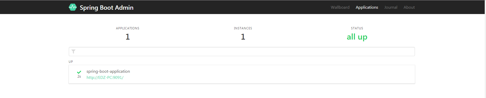

# spring boot admin

[GitHub](https://github.com/codecentric/spring-boot-admin) | 
[文档](http://codecentric.github.io/spring-boot-admin/current/#_what_is_spring_boot_admin)

# 是什么
Spring Boot Admin 是一个社区项目，用于监控基于 Spring Boot 的应用，它是在 Spring Boot Actuator 的基础上提供简洁的可视化 WEB UI。

# 可以干嘛

在 Spring Boot Actuator 的基础上构建了一套友好的 WEB UI方便快速查看及综合管理

可以同时监控一个或多个 Spring Boot 应用，`分为Server端和Client端 Client通过http向Server端注册`， 也可以结合Spring Cloud 的服务注册组件Eureka 进行注册

[参考文章](https://www.jianshu.com/p/81ad086379b0)


# 怎么使用


**1. 创建一个admin服务 admin-server-learn 导入相应依赖**

```xml
<dependency>
    <groupId>de.codecentric</groupId>
    <artifactId>spring-boot-admin-server</artifactId>
    <version>2.1.3</version>
</dependency>

<dependency>
    <groupId>de.codecentric</groupId>
    <artifactId>spring-boot-admin-server-ui</artifactId>
    <version>2.1.3</version>
</dependency>
```

**1.1. 修改默认端口**

```yaml
server:
  port: 9090
```

**1.2. 启动激活 admin-server 服务**

`@EnableAdminServer`
```
/**
 * spring-boot-admin 服务
 * @author pengliang
 * @date 2019/8/23  15:08
 */
@EnableAdminServer
@SpringBootApplication
public class AdminLearnApplication {

    public static void main(String[] args) {
        SpringApplication.run(AdminLearnApplication.class, args);
    }

}
```


**2. 创建一个被监控服务 web-learn**

```xml
<dependency>
    <groupId>de.codecentric</groupId>
    <artifactId>spring-boot-admin-starter-client</artifactId>
    <version>2.1.3</version>
</dependency>
```

**2.1 注册到 admin server**

```yaml
server:
  port: 9091

spring:
  boot:
    admin:
      client:
        url: http://localhost:9090
```

**3. 启动服务**

访问: http://localhost:9090

